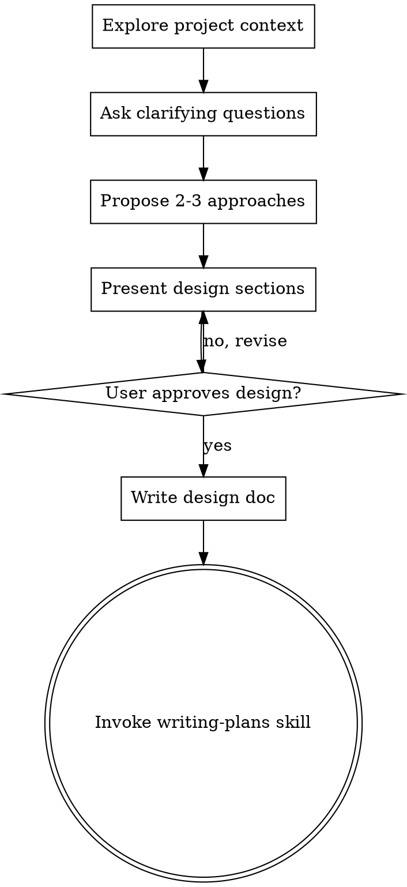
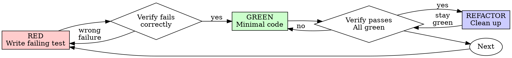
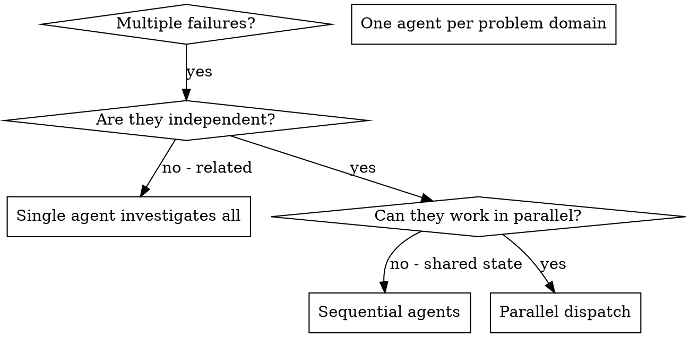

# Brainstorming Ideas Into Designs

## Overview

Help turn ideas into fully formed designs and specs through natural collaborative dialogue.

Start by understanding the current project context, then ask questions one at a time to refine the idea. Once you understand what you're building, present the design and get user approval.

<HARD-GATE>
Do NOT invoke any implementation skill, write any code, scaffold any project, or take any implementation action until you have presented a design and the user has approved it. This applies to EVERY project regardless of perceived simplicity.
</HARD-GATE>

## Anti-Pattern: "This Is Too Simple To Need A Design"

Every project goes through this process. A todo list, a single-function utility, a config change — all of them. "Simple" projects are where unexamined assumptions cause the most wasted work. The design can be short (a few sentences for truly simple projects), but you MUST present it and get approval.

## Checklist

You MUST create a task for each of these items and complete them in order:

1. **Explore project context** — check files, docs, recent commits
2. **Ask clarifying questions** — one at a time, understand purpose/constraints/success criteria
3. **Propose 2-3 approaches** — with trade-offs and your recommendation
4. **Present design** — in sections scaled to their complexity, get user approval after each section
5. **Write design doc** — save to `docs/plans/YYYY-MM-DD-<topic>-design.md` and commit
6. **Transition to implementation** — invoke writing-plans skill to create implementation plan

## Process Flow



**The terminal state is invoking writing-plans.** Do NOT invoke frontend-design, mcp-builder, or any other implementation skill. The ONLY skill you invoke after brainstorming is writing-plans.

## The Process

**Understanding the idea:**
- Check out the current project state first (files, docs, recent commits)
- Ask questions one at a time to refine the idea
- Prefer multiple choice questions when possible, but open-ended is fine too
- Only one question per message - if a topic needs more exploration, break it into multiple questions
- Focus on understanding: purpose, constraints, success criteria

**Exploring approaches:**
- Propose 2-3 different approaches with trade-offs
- Present options conversationally with your recommendation and reasoning
- Lead with your recommended option and explain why

**Presenting the design:**
- Once you believe you understand what you're building, present the design
- Scale each section to its complexity: a few sentences if straightforward, up to 200-300 words if nuanced
- Ask after each section whether it looks right so far
- Cover: architecture, components, data flow, error handling, testing
- Be ready to go back and clarify if something doesn't make sense

## After the Design

**Documentation:**
- Write the validated design to `docs/plans/YYYY-MM-DD-<topic>-design.md`
- Use elements-of-style:writing-clearly-and-concisely skill if available
- Commit the design document to git

**Implementation:**
- Invoke the writing-plans skill to create a detailed implementation plan
- Do NOT invoke any other skill. writing-plans is the next step.

## Key Principles

- **One question at a time** - Don't overwhelm with multiple questions
- **Multiple choice preferred** - Easier to answer than open-ended when possible
- **YAGNI ruthlessly** - Remove unnecessary features from all designs
- **Explore alternatives** - Always propose 2-3 approaches before settling
- **Incremental validation** - Present design, get approval before moving on
- **Be flexible** - Go back and clarify when something doesn't make sense

# Debug to Fix

<purpose>
An elixir for debugging. The #1 debugging mistake: jumping to fixes before
understanding the problem. This chains clarification → investigation → fix →
verification, with gates that prevent skipping steps. Uses rubber-duck to clarify,
built-in investigation phase, and prove-it to verify.
</purpose>

## Prerequisites

This elixir works best with these skills installed:

| Skill | Purpose | If Missing |
|-------|---------|------------|
| rubber-duck | Structured problem clarification | Falls back to built-in questions |
| prove-it | Verification enforcement | Falls back to built-in verification |
| retrospective | Document learnings | Skipped (optional phase) |

The elixir degrades gracefully - it will use built-in fallbacks for missing skills.

## When To Activate

<triggers>
- "Why isn't this working?"
- "It should work but..."
- "I don't understand why..."
- "This doesn't make sense"
- User expresses debugging frustration
- Bug that persists after initial fix attempts
- User has been stuck on same issue for multiple messages
</triggers>

## Instructions

### Phase 1: Clarify

<phase_clarify>
**If rubber-duck skill installed:** Invoke it now.

**If not installed, ask:**

Before we debug, let me understand the problem:

1. **Expected:** What should happen?
2. **Actual:** What actually happens?
3. **Tried:** What have you already attempted?
4. **Changed:** What changed before this broke?

**GATE:** Do not proceed until you can state the problem in one sentence:
"When I [action], I expect [expected], but instead [actual]."

Write this sentence before continuing.
</phase_clarify>

### Phase 2: Investigate

<phase_investigate>
**Objective:** Find the root cause, not just symptoms.

**Investigation checklist:**

1. **Reproduce:** Can you trigger the bug reliably?
   - [ ] Yes, every time
   - [ ] Sometimes (note conditions)
   - [ ] Haven't tried yet → Try now

2. **Isolate:** Where does the bug live?
   - [ ] Identified the file(s)
   - [ ] Identified the function(s)
   - [ ] Narrowed to specific lines

3. **Understand:** Why does it fail?
   - [ ] Read the actual error (not just the message)
   - [ ] Checked the data/state at failure point
   - [ ] Understood the expected flow vs actual flow

**Investigation techniques (try in order):**

```
1. Read the error message completely - what does it actually say?
2. Add logging/print at the failure point - what are the actual values?
3. Trace backwards - where do the bad values come from?
4. Check recent changes - git diff, git log
5. Rubber duck the code flow aloud
```

**GATE:** Do not proceed until you can answer:
- "The bug happens because [specific cause]"
- "I know this because [evidence]"

Write both sentences before continuing.
</phase_investigate>

### Phase 3: Fix

<phase_fix>
**Now** implement the fix.

Before writing code, state:
1. **What** you're changing
2. **Why** this fixes the root cause (not just symptoms)
3. **Risk** of this change breaking something else

Implement the minimal fix. Resist the urge to refactor nearby code.
</phase_fix>

### Phase 4: Verify

<phase_verify>
**If prove-it skill installed:** Invoke it now.

**If not installed:**

Verification checklist:
- [ ] Original bug no longer reproduces
- [ ] Tested the exact scenario from Phase 1
- [ ] Checked for regressions in related functionality
- [ ] Tests pass (if applicable)

**GATE:** Do not declare victory until verification complete.

Show the evidence:
```
VERIFIED:
- [What you tested]
- [What you observed]
- [Why this confirms the fix]
```
</phase_verify>

### Phase 5: Document (Optional)

<phase_document>
**If retrospective skill installed:** Invoke it for significant bugs.

**If not installed or bug was minor:** Skip this phase.

For significant debugging sessions (>15 min), capture:
- What the bug was
- Why it was hard to find
- What you'd do differently
</phase_document>

## Output Format

```markdown
## Debug Session: [Brief description]

### Problem Statement
When I [action], I expect [expected], but instead [actual].

### Root Cause
The bug happens because [cause].
Evidence: [how you know]

### Fix
[What you changed and why]

### Verification
- [x] Original bug fixed
- [x] [Other checks performed]

### Learnings (if significant)
[What you'd do differently]
```

## NEVER

- Jump to fixes before completing Phase 1 (clarify)
- Guess at root cause without evidence (Phase 2)
- Declare "fixed" without verification (Phase 4)
- Skip gates because "I already know the answer"
- Refactor unrelated code while fixing a bug

## ALWAYS

- Write the problem statement sentence before investigating
- State root cause with evidence before fixing
- Verify the exact original scenario after fixing
- Keep fixes minimal and focused

## Example

**User:** "The login is broken, I don't know why"

**Phase 1 - Clarify:**
> Before we debug, help me understand:
> 1. What should happen when you log in?
> 2. What actually happens?
> 3. What have you tried?
> 4. Did anything change recently?
>
> *[User answers]*
>
> Problem statement: "When I submit the login form, I expect to be redirected to /dashboard, but instead I see a blank page with no errors."

**Phase 2 - Investigate:**
> Let me investigate...
> - Checked network tab: POST /api/login returns 200 ✓
> - Checked console: No errors ✓
> - Checked redirect logic: `router.push('/dashboard')` is called
> - Added logging: redirect fires but page doesn't change
> - Checked recent commits: Found change to middleware yesterday
>
> Root cause: "The bug happens because new auth middleware redirects /dashboard back to /login for users without 'verified' flag, creating a loop that results in blank page."
> Evidence: "Middleware logs show redirect loop, user object missing 'verified' field."

**Phase 3 - Fix:**
> Fixing: Add 'verified: true' to user object after successful login
> Why: Root cause is missing field, not redirect logic
> Risk: Low - only affects login success path

**Phase 4 - Verify:**
> VERIFIED:
> - Logged in with test user → redirected to /dashboard ✓
> - No redirect loop in network tab ✓
> - Middleware logs show single redirect ✓
> - Existing tests pass ✓

---
name: test-driven-development
description: Use when implementing any feature or bugfix, before writing implementation code
---

# Test-Driven Development (TDD)

## Overview

Write the test first. Watch it fail. Write minimal code to pass.

**Core principle:** If you didn't watch the test fail, you don't know if it tests the right thing.

**Violating the letter of the rules is violating the spirit of the rules.**

## When to Use

**Always:**
- New features
- Bug fixes
- Refactoring
- Behavior changes

**Exceptions (ask your human partner):**
- Throwaway prototypes
- Generated code
- Configuration files

Thinking "skip TDD just this once"? Stop. That's rationalization.

## The Iron Law

```
NO PRODUCTION CODE WITHOUT A FAILING TEST FIRST
```

Write code before the test? Delete it. Start over.

**No exceptions:**
- Don't keep it as "reference"
- Don't "adapt" it while writing tests
- Don't look at it
- Delete means delete

Implement fresh from tests. Period.

## Red-Green-Refactor



### RED - Write Failing Test

Write one minimal test showing what should happen.

<Good>
```typescript
test('retries failed operations 3 times', async () => {
  let attempts = 0;
  const operation = () => {
    attempts++;
    if (attempts < 3) throw new Error('fail');
    return 'success';
  };

  const result = await retryOperation(operation);

  expect(result).toBe('success');
  expect(attempts).toBe(3);
});
```
Clear name, tests real behavior, one thing
</Good>

<Bad>
```typescript
test('retry works', async () => {
  const mock = jest.fn()
    .mockRejectedValueOnce(new Error())
    .mockRejectedValueOnce(new Error())
    .mockResolvedValueOnce('success');
  await retryOperation(mock);
  expect(mock).toHaveBeenCalledTimes(3);
});
```
Vague name, tests mock not code
</Bad>

**Requirements:**
- One behavior
- Clear name
- Real code (no mocks unless unavoidable)

### Verify RED - Watch It Fail

**MANDATORY. Never skip.**

```bash
npm test path/to/test.test.ts
```

Confirm:
- Test fails (not errors)
- Failure message is expected
- Fails because feature missing (not typos)

**Test passes?** You're testing existing behavior. Fix test.

**Test errors?** Fix error, re-run until it fails correctly.

### GREEN - Minimal Code

Write simplest code to pass the test.

<Good>
```typescript
async function retryOperation<T>(fn: () => Promise<T>): Promise<T> {
  for (let i = 0; i < 3; i++) {
    try {
      return await fn();
    } catch (e) {
      if (i === 2) throw e;
    }
  }
  throw new Error('unreachable');
}
```
Just enough to pass
</Good>

<Bad>
```typescript
async function retryOperation<T>(
  fn: () => Promise<T>,
  options?: {
    maxRetries?: number;
    backoff?: 'linear' | 'exponential';
    onRetry?: (attempt: number) => void;
  }
): Promise<T> {
  // YAGNI
}
```
Over-engineered
</Bad>

Don't add features, refactor other code, or "improve" beyond the test.

### Verify GREEN - Watch It Pass

**MANDATORY.**

```bash
npm test path/to/test.test.ts
```

Confirm:
- Test passes
- Other tests still pass
- Output pristine (no errors, warnings)

**Test fails?** Fix code, not test.

**Other tests fail?** Fix now.

### REFACTOR - Clean Up

After green only:
- Remove duplication
- Improve names
- Extract helpers

Keep tests green. Don't add behavior.

### Repeat

Next failing test for next feature.

## Good Tests

| Quality | Good | Bad |
|---------|------|-----|
| **Minimal** | One thing. "and" in name? Split it. | `test('validates email and domain and whitespace')` |
| **Clear** | Name describes behavior | `test('test1')` |
| **Shows intent** | Demonstrates desired API | Obscures what code should do |

When writing or changing any test, read [writing-good-tests.md](writing-good-tests.md) for the rules that keep tests honest:
- Name the production change that would make the test fail — before writing it
- Assert on real behavior, never on mock behavior
- Keep test-only code in test utilities, out of production classes
- Understand a dependency's side effects before mocking it

## Common Rationalizations

| Excuse | Reality |
|--------|---------|
| "Too simple to test" | Simple code breaks. Test takes 30 seconds. |
| "I'll test after" | Tests written after pass immediately — which proves nothing. They may test the wrong thing, test the implementation instead of the behavior, or miss the edge case you forgot. You never watched it fail, so you never proved it can catch the bug. Test-first forces that failure. |
| "Tests after achieve same goals (spirit not ritual)" | Tests-after answer "what does this do?"; tests-first answer "what should this do?" Tests written after are biased by the code you already wrote — you verify the cases you remembered, not the ones you'd have discovered. Coverage without proof the tests work. |
| "Already manually tested" | Manual testing is ad-hoc: no record of what you covered, no way to re-run it when the code changes, easy to forget cases under pressure. "Worked when I tried it" ≠ comprehensive. Automated tests run the same way every time. |
| "Deleting X hours is wasteful" | Sunk cost fallacy — that time is already spent either way. The real choice: rewrite with TDD (high confidence) vs. keep it and bolt tests on after (low confidence, likely bugs). Keeping code you can't trust is the waste. |
| "Keep as reference, write tests first" | You'll adapt it. That's testing after. Delete means delete. |
| "Need to explore first" | Fine. Throw away exploration, start with TDD. |
| "Test hard = design unclear" | Listen to test. Hard to test = hard to use. |
| "TDD will slow me down" | TDD IS the pragmatic path: catches bugs before commit, prevents regressions, lets you refactor without fear. "Pragmatic" shortcuts mean debugging in production — slower, not faster. |
| "Manual test faster" | Manual doesn't prove edge cases. You'll re-test every change. |
| "Existing code has no tests" | You're improving it. Add tests for existing code. |

## Red Flags - STOP and Start Over

- Code before test
- Test after implementation
- Test passes immediately
- Can't explain why test failed
- Tests added "later"
- Rationalizing "just this once"
- "I already manually tested it"
- "Tests after achieve the same purpose"
- "It's about spirit not ritual"
- "Keep as reference" or "adapt existing code"
- "Already spent X hours, deleting is wasteful"
- "TDD is dogmatic, I'm being pragmatic"
- "This is different because..."

**All of these mean: Delete code. Start over with TDD.**

## Example: Bug Fix

**Bug:** Empty email accepted

**RED**
```typescript
test('rejects empty email', async () => {
  const result = await submitForm({ email: '' });
  expect(result.error).toBe('Email required');
});
```

**Verify RED**
```bash
$ npm test
FAIL: expected 'Email required', got undefined
```

**GREEN**
```typescript
function submitForm(data: FormData) {
  if (!data.email?.trim()) {
    return { error: 'Email required' };
  }
  // ...
}
```

**Verify GREEN**
```bash
$ npm test
PASS
```

**REFACTOR**
Extract validation for multiple fields if needed.

## Verification Checklist

Before marking work complete:

- [ ] Every new function/method has a test
- [ ] Watched each test fail before implementing
- [ ] Each test failed for expected reason (feature missing, not typo)
- [ ] Wrote minimal code to pass each test
- [ ] All tests pass
- [ ] Output pristine (no errors, warnings)
- [ ] Tests use real code (mocks only if unavoidable)
- [ ] Edge cases and errors covered

Can't check all boxes? You skipped TDD. Start over.

## When Stuck

| Problem | Solution |
|---------|----------|
| Don't know how to test | Write wished-for API. Write assertion first. Ask your human partner. |
| Test too complicated | Design too complicated. Simplify interface. |
| Must mock everything | Code too coupled. Use dependency injection. |
| Test setup huge | Extract helpers. Still complex? Simplify design. |

## Debugging Integration

Bug found? Write failing test reproducing it. Follow TDD cycle. Test proves fix and prevents regression.

Never fix bugs without a test.

## Final Rule

```
Production code → test exists and failed first
Otherwise → not TDD
```

No exceptions without your human partner's permission.

---
name: verification-before-completion
description: Use when about to claim work is complete, fixed, or passing, before committing or creating PRs - requires running verification commands and confirming output before making any success claims; evidence before assertions always
---

# Verification Before Completion

## Overview

**Core principle:** Evidence before claims, always.

**Violating the letter of this rule is violating the spirit of this rule.**

## The Iron Law

```
NO COMPLETION CLAIMS WITHOUT FRESH VERIFICATION EVIDENCE
```

If you haven't run the verification command in this message, you cannot claim it passes.

## The Gate Function

```
BEFORE claiming any status or expressing satisfaction:

1. IDENTIFY: What command proves this claim?
2. RUN: Execute the FULL command (fresh, complete)
3. READ: Full output, check exit code, count failures
4. VERIFY: Does output confirm the claim?
   - If NO: State actual status with evidence
   - If YES: State claim WITH evidence
5. ONLY THEN: Make the claim

Skip any step = lying, not verifying
```

## Common Failures

| Claim | Requires | Not Sufficient |
|-------|----------|----------------|
| Tests pass | Test command output: 0 failures | Previous run, "should pass" |
| Linter clean | Linter output: 0 errors | Partial check, extrapolation |
| Build succeeds | Build command: exit 0 | Linter passing, logs look good |
| Bug fixed | Test original symptom: passes | Code changed, assumed fixed |
| Regression test works | Red-green cycle verified | Test passes once |
| Agent completed | VCS diff shows changes | Agent reports "success" |
| Requirements met | Line-by-line checklist | Tests passing |

## Red Flags - STOP

- Using "should", "probably", "seems to"
- Expressing satisfaction before verification ("Great!", "Perfect!", "Done!", etc.)
- About to commit/push/PR without verification
- Trusting agent success reports
- Relying on partial verification
- Thinking "just this once"
- Tired and wanting work over
- **ANY wording implying success without having run verification**

## Rationalization Prevention

| Excuse | Reality |
|--------|---------|
| "Should work now" | RUN the verification |
| "I'm confident" | Confidence ≠ evidence |
| "Just this once" | No exceptions |
| "Linter passed" | Linter ≠ compiler |
| "Agent said success" | Verify independently |
| "I'm tired" | Exhaustion ≠ excuse |
| "Partial check is enough" | Partial proves nothing |
| "Different words so rule doesn't apply" | Spirit over letter |

## Key Patterns

**Tests:**
```
✅ [Run test command] [See: 34/34 pass] "All tests pass"
❌ "Should pass now" / "Looks correct"
```

**Regression tests (TDD Red-Green):**
```
✅ Write → Run (pass) → Revert fix → Run (MUST FAIL) → Restore → Run (pass)
❌ "I've written a regression test" (without red-green verification)
```

**Build:**
```
✅ [Run build] [See: exit 0] "Build passes"
❌ "Linter passed" (linter doesn't check compilation)
```

**Requirements:**
```
✅ Re-read plan → Create checklist → Verify each → Report gaps or completion
❌ "Tests pass, phase complete"
```

**Agent delegation:**
```
✅ Agent reports success → Check VCS diff → Verify changes → Report actual state
❌ Trust agent report
```

## When To Apply

**ALWAYS before:**
- ANY variation of success/completion claims
- ANY expression of satisfaction
- ANY positive statement about work state
- Committing, PR creation, task completion
- Moving to next task
- Delegating to agents

**Rule applies to:**
- Exact phrases
- Paraphrases and synonyms
- Implications of success
- ANY communication suggesting completion/correctness

# Executing Plans

## Overview

Load plan, review critically, execute tasks in batches, report for review between batches.

**Core principle:** Batch execution with checkpoints for architect review.

**Announce at start:** "I'm using the executing-plans skill to implement this plan."

## The Process

### Step 1: Load and Review Plan
1. Read plan file
2. Review critically - identify any questions or concerns about the plan
3. If concerns: Raise them with your human partner before starting
4. If no concerns: Create TodoWrite and proceed

### Step 2: Execute Batch
**Default: First 3 tasks**

For each task:
1. Mark as in_progress
2. Follow each step exactly (plan has bite-sized steps)
3. Run verifications as specified
4. Mark as completed

### Step 3: Report
When batch complete:
- Show what was implemented
- Show verification output
- Say: "Ready for feedback."

### Step 4: Continue
Based on feedback:
- Apply changes if needed
- Execute next batch
- Repeat until complete

### Step 5: Complete Development

After all tasks complete and verified:
- Announce: "I'm using the finishing-a-development-branch skill to complete this work."
- **REQUIRED SUB-SKILL:** Use superpowers:finishing-a-development-branch
- Follow that skill to verify tests, present options, execute choice

## When to Stop and Ask for Help

**STOP executing immediately when:**
- Hit a blocker mid-batch (missing dependency, test fails, instruction unclear)
- Plan has critical gaps preventing starting
- You don't understand an instruction
- Verification fails repeatedly

**Ask for clarification rather than guessing.**

## When to Revisit Earlier Steps

**Return to Review (Step 1) when:**
- Partner updates the plan based on your feedback
- Fundamental approach needs rethinking

**Don't force through blockers** - stop and ask.

## Remember
- Review plan critically first
- Follow plan steps exactly
- Don't skip verifications
- Reference skills when plan says to
- Between batches: just report and wait
- Stop when blocked, don't guess
- Never start implementation on main/master branch without explicit user consent

## Integration

**Required workflow skills:**
- **superpowers:using-git-worktrees** - REQUIRED: Set up isolated workspace before starting
- **superpowers:writing-plans** - Creates the plan this skill executes
- **superpowers:finishing-a-development-branch** - Complete development after all tasks

# Requesting Code Review

Dispatch superpowers:code-reviewer subagent to catch issues before they cascade.

**Core principle:** Review early, review often.

## When to Request Review

**Mandatory:**
- After each task in subagent-driven development
- After completing major feature
- Before merge to main

**Optional but valuable:**
- When stuck (fresh perspective)
- Before refactoring (baseline check)
- After fixing complex bug

## How to Request

**1. Get git SHAs:**
```bash
BASE_SHA=$(git rev-parse HEAD~1)  # or origin/main
HEAD_SHA=$(git rev-parse HEAD)
```

**2. Dispatch code-reviewer subagent:**

Use Task tool with superpowers:code-reviewer type, fill template at `code-reviewer.md`

**Placeholders:**
- `{WHAT_WAS_IMPLEMENTED}` - What you just built
- `{PLAN_OR_REQUIREMENTS}` - What it should do
- `{BASE_SHA}` - Starting commit
- `{HEAD_SHA}` - Ending commit
- `{DESCRIPTION}` - Brief summary

**3. Act on feedback:**
- Fix Critical issues immediately
- Fix Important issues before proceeding
- Note Minor issues for later
- Push back if reviewer is wrong (with reasoning)

## Example

```
[Just completed Task 2: Add verification function]

You: Let me request code review before proceeding.

BASE_SHA=$(git log --oneline | grep "Task 1" | head -1 | awk '{print $1}')
HEAD_SHA=$(git rev-parse HEAD)

[Dispatch superpowers:code-reviewer subagent]
  WHAT_WAS_IMPLEMENTED: Verification and repair functions for conversation index
  PLAN_OR_REQUIREMENTS: Task 2 from docs/plans/deployment-plan.md
  BASE_SHA: a7981ec
  HEAD_SHA: 3df7661
  DESCRIPTION: Added verifyIndex() and repairIndex() with 4 issue types

[Subagent returns]:
  Strengths: Clean architecture, real tests
  Issues:
    Important: Missing progress indicators
    Minor: Magic number (100) for reporting interval
  Assessment: Ready to proceed

You: [Fix progress indicators]
[Continue to Task 3]
```

## Integration with Workflows

**Subagent-Driven Development:**
- Review after EACH task
- Catch issues before they compound
- Fix before moving to next task

**Executing Plans:**
- Review after each batch (3 tasks)
- Get feedback, apply, continue

**Ad-Hoc Development:**
- Review before merge
- Review when stuck

## Red Flags

**Never:**
- Skip review because "it's simple"
- Ignore Critical issues
- Proceed with unfixed Important issues
- Argue with valid technical feedback

**If reviewer wrong:**
- Push back with technical reasoning
- Show code/tests that prove it works
- Request clarification

See template at: requesting-code-review/code-reviewer.md

# Dispatching Parallel Agents

## Overview

You delegate tasks to specialized agents with isolated context. By precisely crafting their instructions and context, you ensure they stay focused and succeed at their task. They should never inherit your session's context or history — you construct exactly what they need. This also preserves your own context for coordination work.

When you have multiple unrelated failures (different test files, different subsystems, different bugs), investigating them sequentially wastes time. Each investigation is independent and can happen in parallel.

**Core principle:** Dispatch one agent per independent problem domain. Let them work concurrently.

## When to Use



**Use when:**

- 3+ test files failing with different root causes
- Multiple subsystems broken independently
- Each problem can be understood without context from others
- No shared state between investigations

**Don't use when:**

- Failures are related (fix one might fix others)
- Need to understand full system state
- Agents would interfere with each other

## The Pattern

### 1. Identify Independent Domains

Group failures by what's broken:

- File A tests: Tool approval flow
- File B tests: Batch completion behavior
- File C tests: Abort functionality

Each domain is independent - fixing tool approval doesn't affect abort tests.

### 2. Create Focused Agent Tasks

Each agent gets:

- Specific scope: One test file or subsystem
- Clear goal: Make these tests pass
- Constraints: Don't change other code
- Expected output: Summary of what you found and fixed

### 3. Dispatch in Parallel

```text
// In Claude Code / AI environment

Task
(
"Fix agent-tool-abort.test.ts failures"
)

Task
(
"Fix batch-completion-behavior.test.ts failures"
)

Task
(
"Fix tool-approval-race-conditions.test.ts failures"
)

// All three run concurrently
```

### 4. Review and Integrate

When agents return:

- Read each summary
- Verify fixes don't conflict
- Run full test suite
- Integrate all changes

## Agent Prompt Structure

Good agent prompts are:

1. Focused - One clear problem domain
1. Self-contained - All context needed to understand the problem
1. Specific about output - What should the agent return?

```text
Fix the 3 failing tests in src/agents/agent-tool-abort.test.ts:

1.
 "should abort tool with partial output capture" - expects 'interrupted at' in message

2.
 "should handle mixed completed and aborted tools" - fast tool aborted instead of completed

3.
 "should properly track pendingToolCount" - expects 3 results but gets 0

These are timing/race condition issues. Your task:

1.
 Read the test file and understand what each test verifies

2.
 Identify root cause - timing issues or actual bugs?

3.
 Fix by:

   -
 Replacing arbitrary timeouts with event-based waiting

   -
 Fixing bugs in abort implementation if found

   -
 Adjusting test expectations if testing changed behavior

Do NOT just increase timeouts - find the real issue.

Return: Summary of what you found and what you fixed.
```

## Common Mistakes

**❌ Too broad:** "Fix all the tests" - agent gets lost**✅ Specific:** "Fix agent-tool-abort.test.ts" - focused scope

**❌ No context:** "Fix the race condition" - agent doesn't know where**✅ Context:** Paste the error messages and test names

**❌ No constraints:** Agent might refactor everything**✅ Constraints:** "Do NOT change production code" or "Fix tests only"

**❌ Vague output:** "Fix it" - you don't know what changed**✅ Specific:** "Return summary of root cause and changes"

## When NOT to Use

**Related failures:** Fixing one might fix others - investigate together first**Need full context:** Understanding requires seeing entire system**Exploratory debugging:** You don't know what's broken yet**Shared state:** Agents would interfere (editing same files, using same resources)

## Real Example from Session

**Scenario:** 6 test failures across 3 files after major refactoring

**Failures:**

- agent-tool-abort.test.ts: 3 failures (timing issues)
- batch-completion-behavior.test.ts: 2 failures (tools not executing)
- tool-approval-race-conditions.test.ts: 1 failure (execution count = 0)

**Decision:** Independent domains - abort logic separate from batch completion separate from race conditions

**Dispatch:**

```text
Agent 1 → Fix agent-tool-abort.test.ts

Agent 2 → Fix batch-completion-behavior.test.ts

Agent 3 → Fix tool-approval-race-conditions.test.ts
```

**Results:**

- Agent 1: Replaced timeouts with event-based waiting
- Agent 2: Fixed event structure bug (threadId in wrong place)
- Agent 3: Added wait for async tool execution to complete

**Integration:** All fixes independent, no conflicts, full suite green

**Time saved:** 3 problems solved in parallel vs sequentially

## Key Benefits

1. Parallelization - Multiple investigations happen simultaneously
1. Focus - Each agent has narrow scope, less context to track
1. Independence - Agents don't interfere with each other
1. Speed - 3 problems solved in time of 1

## Verification

After agents return:

1. Review each summary - Understand what changed
1. Check for conflicts - Did agents edit same code?
1. Run full suite - Verify all fixes work together
1. Spot check - Agents can make systematic errors

## Real-World Impact

From debugging session (2025-10-03):

- 6 failures across 3 files
- 3 agents dispatched in parallel
- All investigations completed concurrently
- All fixes integrated successfully
- Zero conflicts between agent changes
